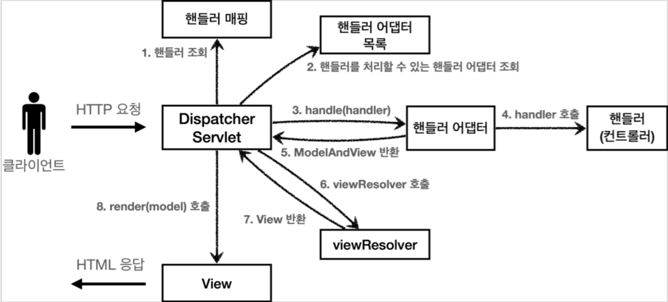

# *`🌱Spring DispatcherServlet`*

## 서론

`SpringProject`에서 `@annotation` 기반 `Controller` 설정하고 `@RequstMapping`에 설정된 `URL`로 메서드를 호출하여 사용하다보면,</br>
문득 스프링의 내부에서는 내가 선언한 매개변수들을 어떻게 찰떡 같이 전달해주는지 궁금해진다.</br>
`ArgumentResolver`를 통해 매개변수를 전달해주는 것을 대강은 알고 있지만, 이제 자세히 알아보고 싶어졌다.</br>
그래서 이번 포스팅에서는 `DispatcherServlet`이 어떻게 동작하는지 알아보고자 한다.

## `☕️Java`의 `Servlet`이란?

먼저 `DispatcherServlet`을 알아보기 전에 `Java`의 `Servlet`이란 무엇인지 알아보자.</br>
`Servlet`은 `Java`에서 동적인 웹 페이지를 생성하는 서버 측의 프로그램 혹은 그 사양을 뜻한다고 한다.
[Wiki_Servlet:참조_링크](https://ko.wikipedia.org/wiki/자바_서블릿)</br>
다양한 기능을 제공하는 `Servlet`을 사용하려면 `Interface`인 `Servlet`을 구현해야 한다.</br>
보통 `Servlet`을 구현할 때는 `HttpServlet`을 상속받아 구현하여 사용하는데, 사용 예시는 아래와 같다.

```java

@WebServlet(name = "memberSaveServlet", urlPatterns = "/hello/servlet")
public class HelloServlet extends HttpServlet {
    @Override
    protected void service(final HttpServletRequest request, final HttpServletResponse response) throws ServletException, IOException {
        logger.info("hello.servlet");
    }
}
```

다만 `HttpServlet`을 직접 구현하여 사용하면 핵심 로직 이외의 코드가 많아지고(`View` 렌더링 코드, `Http` 요청 파싱 코드 등등) 유지보수 등 여러가지 문제가 발생할 수 있다.</br>
그래서 `Spring`에서는 `HttpServlet`을 상속받아 구현한 `DispatcherServlet`을 제공한다.</br>

## `🌱DispatcherServlet`이란?



`Spring`은 앞서 말한 문제점을 `FrontController` 패턴을 적용하여 해결하는데, `DispatcherServlet`이 `FrontController`의 역할을 한다.</br>
`DispatcherServlet`은 `Spring`에서 제공하는 `Servlet`으로, `SpringMVC`의 핵심이라고 할 수 있다.</br>
`DispatcherServlet`은 `HandlerMapping`을 통해 `Controller`를 찾고, `HandlerAdapter`를 통해 `Controller`의 메서드를 호출한다.</br>
`HandlerAdapter`가 메서드를 호출하기 전 해당 메서드에 필요한 매개변수의 데이터를 넣어주는 것이 `ArgumentResolver`이다.</br>

## `🌱DispatcherServlet`의 동작 과정

1. `Client`를 통해 전달된 `HTTP` 요청을 `DispatcherServlet`이 수신하고,
   <br/>`doService` 메서드 내의 `doDispatch(request, response)` 메서드를 호출한다.
2. `doDispatch(request, response)` 메서드에서는 `getHandler(processedRequest)`를 통해 `Controller`를 찾는다.<br/>
   만약 `Controller`를 찾지 못하면 `404:NotFound` 에러를 반환한다.<br/>
   (참고로 `throwExceptionIfNoHandlerFound` 옵션을 통해 `Exception`을 던질 수 있다. 기본 값은 `false`이다.)

```java

public class DispatcherServlet extends FrameworkServlet {
    protected void noHandlerFound(HttpServletRequest request, HttpServletResponse response) throws Exception {
        if (pageNotFoundLogger.isWarnEnabled()) {
            pageNotFoundLogger.warn("No mapping for " + request.getMethod() + " " + getRequestUri(request));
        }
        if (this.throwExceptionIfNoHandlerFound) {
            throw new NoHandlerFoundException(request.getMethod(), getRequestUri(request),
                    new ServletServerHttpRequest(request).getHeaders());
        } else {
            response.sendError(HttpServletResponse.SC_NOT_FOUND);
        }
    }
}
```

3. `HandlerAdapter`를 통해 `Controller`의 메서드를 호출하는데, 이때 `ArgumentResolver`를 통해 매개변수를 전달한다.<br/>
   먼저 `doDispatch(request, response)` 메서드에서 `getHandlerAdapter(mappedHandler.getHandler())`를 통해 `HandlerAdapter`를
   가져온다.<br/>
   그리고 `HandlerAdapter`의 `handle()` 메서드를 호출하는데, 이때 `HandlerAdapter`는 `Controller`의 메서드를 호출하고,<br/>
   `ArgumentResolver`를 통해 매개변수를 전달한다.

4. `Controller`의 메서드가 실행되고, 결과가 `ModelAndView`로 반환된다.<br/>
   `ModelAndView`는 `ViewResolver`를 통해 `View`를 찾고, `render` 메서드를 통해 `View`를 렌더링한다.

### 다양한 파라미터에 대한 `ArgumentResolver`의 동작 과정

| `ParameterType`       | `ArgumentResolver`                      |
|-----------------------|-----------------------------------------|
| `@RequestParam`       | `RequestParamMethodArgumentResolver`    |
| `@PathVariable`       | `PathVariableMethodArgumentResolver`    |
| `@RequestBody`        | `RequestBodyMethodArgumentResolver`     |
| `@ModelAttribute`     | `ModelAttributeMethodProcessor`         |
| `HttpServletRequest`  | `ServletRequestMethodArgumentResolver`  |
| `HttpServletResponse` | `ServletResponseMethodArgumentResolver` |

모두 `RequestMappingHandlerAdapter`에서 사용하는 `ArgumentResolver`이다.

## *`HttpMessageConverter`*

`ArgumentResolver`를 통해 매개변수를 전달하는 것을 알았으니, 이제 `ArgumentResolver`가 어떻게 매개변수를 전달하는지 알아보자.</br>
`ArgumentResolver`는 `HttpMessageConverter`를 통해 매개변수를 전달한다.</br>
이 `HttpMessageConverter`는 `Spring`에서 `HTTP` 요청 본문을 객체로 변환하거나, 객체를 `HTTP` 응답 본문으로 변환할 때 사용한다.</br>
즉 `@RequestBody`를 통해 `HTTP` 요청 본문을 객체로 변환할 때, `@ResponseBody`를 통해 객체를 `HTTP` 응답 본문으로 변환할 때 사용한다.</br>
컨트롤러에서는 컨트롤러 메서드의 반환 타입이 `String`인 경우, `View` 이름으로 인식하고 `Model`을 반환 타입으로 인식하지만,<br/>
`@ResponseBody`를 사용하면 `View`를 사용하지 않고, `HTTP` 응답 본문에 직접 데이터를 입력할 수 있다.</br>

### `HttpMessageConverter`의 종류

| `HttpMessageConverter`                | 설명                      |
|---------------------------------------|-------------------------|
| `ByteArrayHttpMessageConverter`       | `byte[]` 타입의 데이터를 처리한다. |
| `StringHttpMessageConverter`          | `String` 타입의 데이터를 처리한다. |
| `MappingJackson2HttpMessageConverter` | `JSON` 데이터를 처리한다.       |

`HttpMessageConverter`는 `Spring`에서 제공하는 것 뿐만 아니라, `Jackson`이나 `Gson` 등 다양한 라이브러리에서 제공하는 것을 사용할 수 있다.</br>

## `🌱Spring`은 어떻게 이런 동작을 구현할까?

`Spring`은 `DispatcherServlet`을 통해 `FrontController` 패턴을 적용하고, `HandlerMapping`과 `HandlerAdapter`를 통해 `Controller`를
찾고, `Controller`의 메서드를 호출한다.</br>
`Hander`를 찾아서 매개변수를 전달하는 일련의 과정을 `Java`의 `Reflection`을 통해 구현한다.</br>
`Reflection`은 `Java`가 런타임에서 클래스의 정보를 가져오고, 객체를 생성하고, 메서드를 호출할 수 있도록 해주는 기능(API)이다.</br>
`Spring`은 `Reflection`을 통해 `Controller`를 찾고, `Controller`의 메서드를 호출하고, 매개변수를 전달한다.</br>

## 결론

`Spring`의 `DispatcherServlet`은 웹 애플리케이션에서 가장 기본이 되는 요청과 응답이라는 핵심 기능을 플렉서블하게 구현할 수 있도록 도와준다.</br>
이를 통해 개발자는 자신이 필요로 하는 기능의 구현을 제약없이 할 수 있게 되었지만,</br> 그 동작 방식에 대한 이해가 있어야 발생할 수 있는 문제를 예방 및 대응하고,</br>
필요한 기능을 추가할 수 있게 된다.
